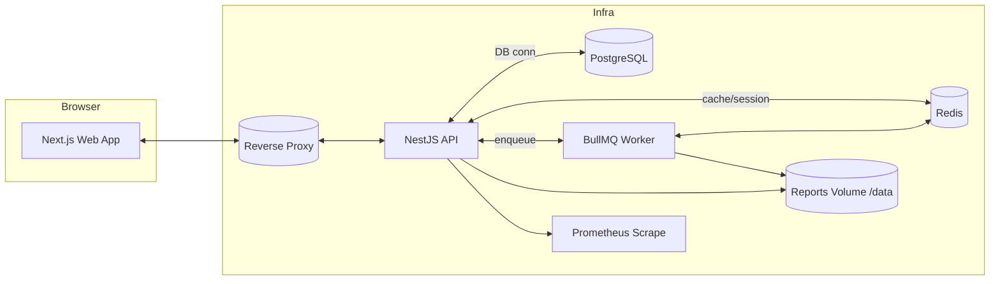
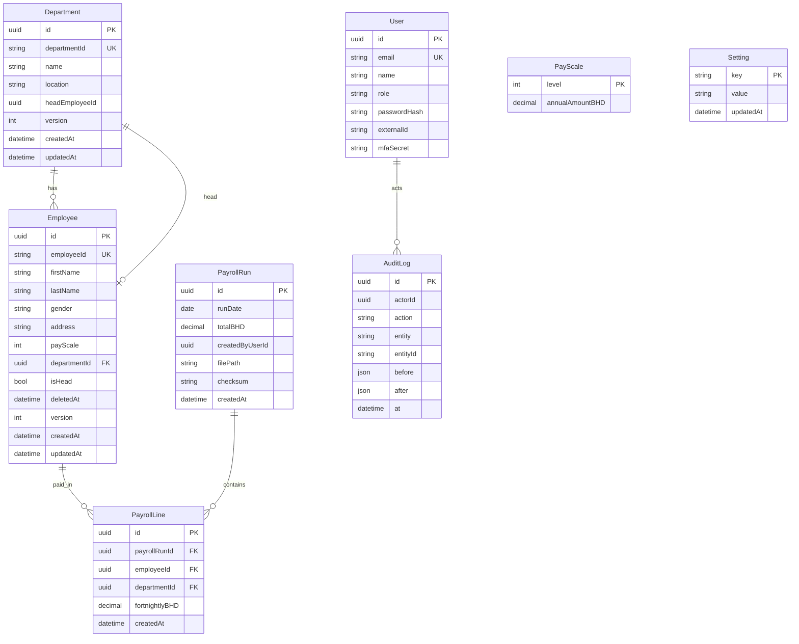

# ARCHITECTURE

## High-Level

```mermaid
flowchart LR
  subgraph Browser
    UI[Next.js Web App]
  end
  subgraph Infra
    NGINX[(Reverse Proxy)]
    API[NestJS API]
    WRK[BullMQ Worker]
    REDIS[(Redis)]
    PG[(PostgreSQL)]
    FS[(Reports Volume /data)]
    PROM[Prometheus Scrape]
  end
  UI <---> NGINX
  NGINX <---> API
  API <-- DB conn --> PG
  API <-- cache/session --> REDIS
  API <-- enqueue --> WRK
  WRK <---> REDIS
  WRK --> FS
  API --> FS
  API --> PROM
```
## ERD

```mermaid
erDiagram
  Department ||--o{ Employee : has
  Department ||--o| Employee : head
  Employee ||--o{ PayrollLine : paid_in
  PayrollRun ||--o{ PayrollLine : contains
  User ||--o{ AuditLog : acts
  Department {
    uuid id PK
    string departmentId UK
    string name
    string location
    uuid headEmployeeId
    int version
    datetime createdAt
    datetime updatedAt
  }
  Employee {
    uuid id PK
    string employeeId UK
    string firstName
    string lastName
    string gender
    string address
    int payScale
    uuid departmentId FK
    bool isHead
    datetime deletedAt
    int version
    datetime createdAt
    datetime updatedAt
  }
  PayScale {
    int level PK
    decimal annualAmountBHD
  }
  PayrollRun {
    uuid id PK
    date runDate
    decimal totalBHD
    uuid createdByUserId
    string filePath
    string checksum
    datetime createdAt
  }
  PayrollLine {
    uuid id PK
    uuid payrollRunId FK
    uuid employeeId FK
    uuid departmentId FK
    decimal fortnightlyBHD
    datetime createdAt
  }
  User {
    uuid id PK
    string email UK
    string name
    string role
    string passwordHash
    string externalId
    string mfaSecret
  }
  AuditLog {
    uuid id PK
    uuid actorId
    string action
    string entity
    string entityId
    json before
    json after
    datetime at
  }
  Setting {
    string key PK
    string value
    datetime updatedAt
  }
```
